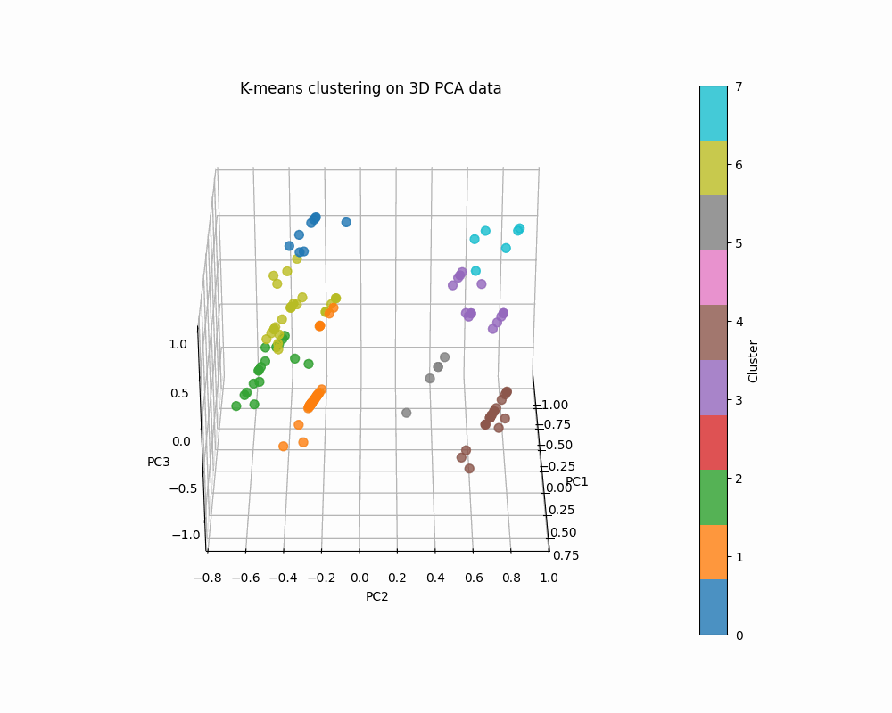

# EDA and Clustering - KN Solvro Recruitment for the ML Section
The goal of the project is to conduct exploratory data analysis and clustering of a dataset from TheCocktailDB.

The project is divided into 6 Jupyter notebooks and the file `scripts_logic.py`:
1. `1_EDA.ipynb` - exploratory data analysis
2. `2_IngredientsEDA.ipynb` - ingredient analysis
3. `3_Preprocessing.ipynb` - preprocessing
4. `4_Further_analysis.ipynb` - data analysis after preprocessing
5. `5_Clustering.ipynb` - creating clusters
6. `6_Results_and_evaluation.ipynb` - final file with results

## Requirements
- Specified in the file `dependencies.txt`

## Results:
- The results are described in the last notebook: `6_Results_and_evaluation.ipynb`, you can run it without going through all the previous ones.
- The cluster animation is saved as `final_clusters.gif`

